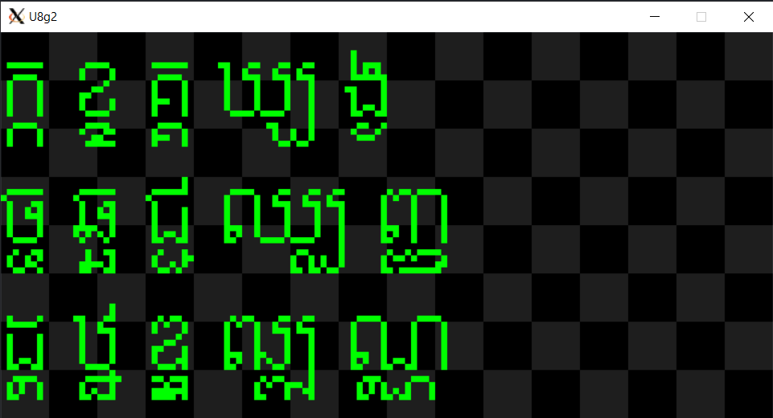

# Building `u8g2` for WSL2 or Linux
`u8g2` requires `sdl2` library for displaying. To install the library, run the following command:

`sudo apt-get install libsdl2-dev`

# Editing and building Khmer fonts

The provided Khmer font is in `.bdf` format and is located in `text_khmer/fonts` folder. Edit the fonts using `gbdfed` or other compatible software.

After editing, build the font using command `make khmer_font`. 

Execute `make` to compile the code, then `./u8g2_sdl` to see the output as shown. Press `n` on keyboad to scroll to the next screen, `p` to scroll to previous screen. `h` to return to the top and `q` to quit the window.

